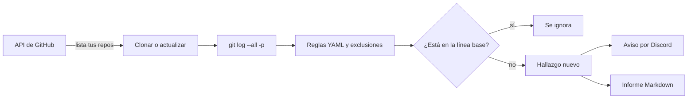

# secret-sweep

Herramienta de línea de comandos que busca **secretos expuestos** (claves de API, tokens, contraseñas, claves privadas) en el **historial completo** de repositorios Git, incluidos los que ya se borraron del código actual. Puede analizar un repositorio local o **todos tus repositorios de GitHub** de una vez, avisar por **Discord** cuando aparece algo nuevo y generar un **informe en Markdown**.

> **Estado:** completo (5 fases: escáner, configuración, API de GitHub, avisos e informes).

Es un proyecto educativo, construido por fases como práctica de DevSecOps. No sustituye a herramientas maduras como Gitleaks (ver [comparación](#comparación-con-gitleaks)).

## ¿Por qué existe?

Cuando se sube un secreto a Git y se borra en el commit siguiente, **sigue estando en el historial**. Cualquiera que clone un repositorio público puede recuperarlo, y existen bots que rastrean GitHub buscando justo eso. Esta herramienta revisa todos los commits de todas las ramas para detectarlo antes que ellos.

## Características

- Analiza el historial completo (`git log --all -p`) en *streaming*: funciona con repositorios grandes sin disparar la memoria.
- Reglas configurables en YAML y lista de exclusiones para falsos positivos.
- **Línea base**: los hallazgos revisados se registran (con motivo y fecha) y dejan de molestar; solo se avisa de lo nuevo.
- Escaneo de todos tus repos con la API de GitHub (listado paginado, clonado y actualización).
- Avisos por Discord con enlace a la línea exacta del commit.
- Informe en Markdown con resumen por repositorio, hallazgos, errores y línea base.
- **Nunca muestra ni envía el valor de un secreto**: ni en la consola, ni en los avisos, ni en el informe, ni en la línea base.

## Cómo funciona



Estructura del proyecto:

```
secret-sweep/
├── src/
│   ├── main.py            # línea de comandos y orquestación
│   ├── scanner.py         # lee el historial y aplica las reglas
│   ├── config.py          # carga y valida rules.yaml
│   ├── rules.yaml         # reglas y exclusiones
│   ├── github_client.py   # API de GitHub: listar, clonar, actualizar
│   ├── baseline.py        # línea base de hallazgos revisados
│   ├── notifier.py        # avisos (interfaz Notifier + Discord)
│   └── report.py          # informe en Markdown
├── tools/
│   └── compare_gitleaks.py
├── tests/
├── .env.example
└── requirements.txt
```

## Requisitos

- Python 3.10 o superior
- Git instalado y disponible en el `PATH`

## Instalación (Windows, PowerShell)

```powershell
git clone https://github.com/robjime/secret-sweep.git
cd secret-sweep
python -m venv .venv
.venv\Scripts\Activate.ps1
pip install -r requirements.txt
```

## Configuración

### Variables de entorno

Copia `.env.example` a `.env` y rellena los valores. El archivo `.env` está en `.gitignore` y **nunca debe subirse**.

| Variable | Para qué sirve | Necesaria para |
|---|---|---|
| `GITHUB_TOKEN` | Token de GitHub *fine-grained*, de solo lectura (permiso *Contents: Read-only*) | `--github` |
| `DISCORD_WEBHOOK_URL` | Webhook del canal de Discord | `--notify` |

### Reglas y exclusiones (`src/rules.yaml`)

Cada regla tiene un nombre y una expresión regular. Para añadir una, basta con añadir otra entrada:

```yaml
rules:
  - name: AWS Access Key ID
    pattern: '\bAKIA[0-9A-Z]{16}\b'
```

Hay tres formas de ignorar un falso positivo:

1. **Patrón sobre el texto detectado** (`allowlist.patterns`): la opción más precisa.
2. **Ruta de archivo** (`allowlist.paths`): ignora archivos enteros; úsala con cuidado, porque crea puntos ciegos.
3. **Marcador en la línea**: `secret-sweep: ignore` en un comentario. Solo afecta a líneas que lo llevaban cuando se añadieron, no al historial anterior.

### Línea base

Para hallazgos concretos ya revisados (por ejemplo, credenciales de demo en un proyecto de prácticas) es mejor la línea base que ensanchar las exclusiones. Se guarda en `baseline.json` (local, no se versiona) y registra repo, regla, commit, archivo, línea, motivo y fecha:

```powershell
python src\main.py --github --accept "motivo de la revisión"
```

## Uso

```powershell
python src\main.py C:\ruta\al\repositorio          # un repositorio local
python src\main.py --github                        # todos tus repos de GitHub
python src\main.py --github --notify --report      # con aviso por Discord e informe
```

| Opción | Descripción |
|---|---|
| `--github` | Escanea todos tus repositorios (requiere `GITHUB_TOKEN`) |
| `--include-forks` | Con `--github`, incluye también los forks |
| `--workdir RUTA` | Dónde se clonan los repos (por defecto `repos/`) |
| `--config RUTA` | Otro archivo de reglas YAML |
| `--baseline RUTA` / `--no-baseline` | Usa otra línea base, o la ignora para ver todo |
| `--accept MOTIVO` | Acepta los hallazgos nuevos y los registra con el motivo |
| `--notify` | Avisa por Discord si hay hallazgos nuevos |
| `--test-notify` | Envía un mensaje de prueba y termina |
| `--report` / `--report-dir RUTA` | Guarda un informe en Markdown (por defecto en `reports/`) |

### Códigos de salida

| Código | Significado |
|---|---|
| `0` | Sin hallazgos nuevos |
| `1` | Hay hallazgos nuevos |
| `2` | Error (o análisis incompleto sin hallazgos) |

Esto permite integrarlo en scripts, en tareas programadas o en un pipeline de CI.

## Decisiones de seguridad

- **El valor de un secreto nunca sale del escáner.** Solo se muestran regla, archivo, línea y commit.
- **El token de GitHub no va en la URL de clonado**, así que no queda guardado en `.git/config`; se pasa como cabecera HTTP temporal. Mientras `git` se ejecuta, es visible en la lista de procesos del equipo: usa un token de solo lectura y de corta duración.
- **Los errores no pueden filtrar credenciales**: los mensajes de error de clonado y de Discord se sanean y hay pruebas que lo verifican.
- **El webhook se valida** antes de usarlo, y los avisos desactivan las menciones (`@everyone`) para que un nombre de archivo no avise a todo el servidor.
- **Un fallo de aviso no oculta hallazgos**, y un análisis incompleto nunca se presenta como "todo limpio".
- `YAML` se carga con `safe_load`.

## Pruebas

```powershell
pytest
```

Las pruebas no necesitan internet: usan una sesión de GitHub simulada, repositorios locales temporales y credenciales **falsas** construidas en tiempo de ejecución.

## Comparación con Gitleaks

[Gitleaks](https://github.com/gitleaks/gitleaks) es la referencia del sector. El script `tools/compare_gitleaks.py` compara ambas herramientas sobre el mismo repositorio, usando solo la ubicación de los hallazgos (nunca los valores):

```powershell
gitleaks git C:\ruta\al\repo --report-format json --report-path gitleaks.json --redact --no-banner
python tools\compare_gitleaks.py C:\ruta\al\repo gitleaks.json
Remove-Item gitleaks.json
```

Resultado sobre un proyecto real de prácticas (servidor OAuth2 con 1 commit, unos 49 KB):

| | Hallazgos |
|---|---:|
| secret-sweep | 6 |
| Gitleaks | 1 |
| En común | 1 |
| Solo secret-sweep | 5 |
| Solo Gitleaks | 0 |

Gitleaks marcó únicamente el secreto de alta entropía. Los otros cinco hallazgos de secret-sweep eran falsos positivos de la regla genérica (un ejemplo en un docstring, una clave de marcador de posición y etiquetas `token_type`), que Gitleaks descarta porque filtra por entropía. En esta muestra secret-sweep no dejó escapar nada que detectara Gitleaks, pero con una precisión mucho menor.

Es un solo repositorio con un solo commit: sirve como ilustración, no como *benchmark*.

## Limitaciones conocidas

- Las reglas son heurísticas: puede haber falsos positivos (la regla genérica de contraseñas) y falsos negativos (formatos que ninguna regla contempla).
- No inspecciona archivos binarios ni contenido comprimido.
- No analiza las referencias de *pull requests* que no se descargan con un clon normal.
- La línea base se basa en hashes de commit: si se reescribe el historial, los hallazgos aceptados vuelven a aparecer como nuevos.

## Ideas para el futuro

- Filtro por entropía en la regla genérica, para reducir falsos positivos.
- Más reglas (Stripe, Slack, otros proveedores).
- Recordar qué hallazgos ya se avisaron, para no repetir el aviso en ejecuciones programadas.
- Ejecución diaria con el Programador de tareas de Windows.

## Aviso de uso

Usa esta herramienta únicamente sobre repositorios **propios** o sobre los que tengas autorización expresa para auditar.
